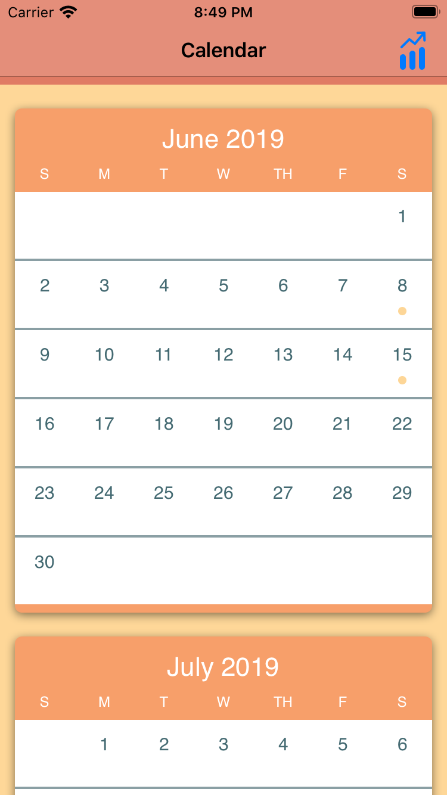

# SwiftCalendar

#### SwiftCalendar is a calendar interface written in Swift 4. Main features include the display of months as scrollable Collection View Cells and the display of events associated with a date in a Table View.  
  
  

The project is written in Swift 4.

Use https://appetize.io to view the app.

Procedure:  
1. Go to https://appetize.io  
2. At the top tab bar, select "Upload"  
3. Click "Select file", and upload SwiftCalendar.zip  
4. Enter email and click "Generate"  
